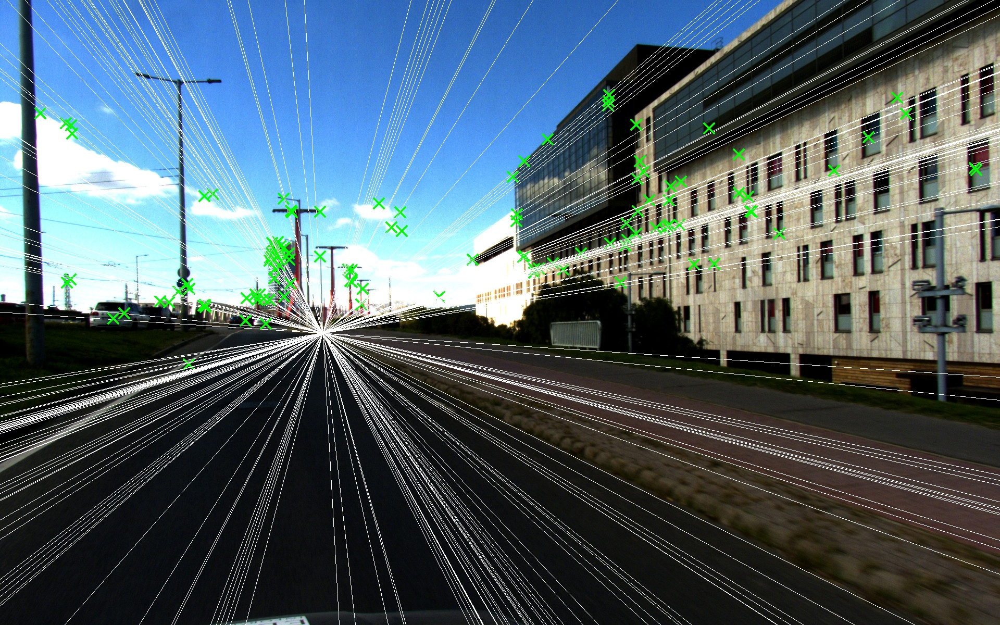
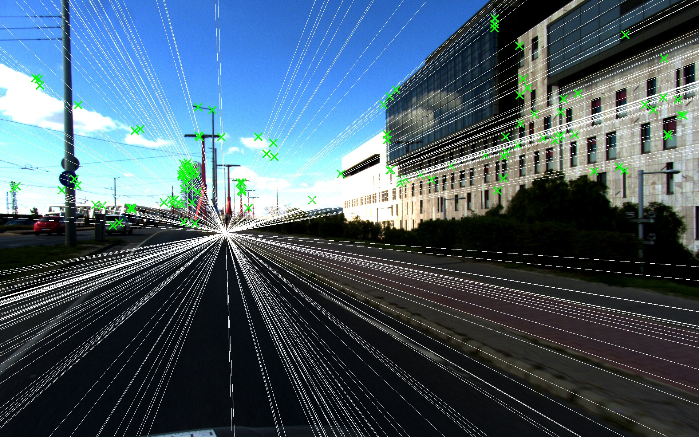

# Fundamental Matrix Estimation
The implementation is based on the work of Qiang Fu et al., as listed in the references section below. The estimation of the Fundamental Matrix relies on two-point correspondences, assuming planar motion.
## Usage

```bash
cmake .
make
./main --file first_image.jpg second_image.jpg --thresh 0.6
```

## Example Result
The images show the matched features and their epipolar lines based on the estimated fundamental matrix. </br> </br>
<a href="url"></a>
<a href="url"></a>

## References

[Fu, Q., Mu, X. & Wang, Y. Minimal solution for estimating fundamental matrix under planar motion. Sci. China Inf. Sci. 64, 209203 (2021).](https://doi.org/10.1007/s11432-019-9925-1)
